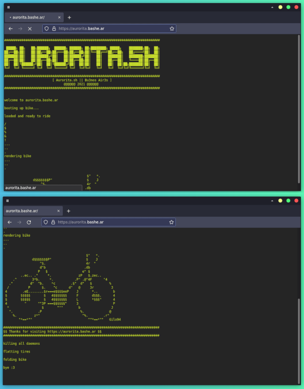

## Aurorita.sh
This is just a fun little project to print the output of a shell script into a web browser using [php popen() function](https://www.php.net/manual/en/function.popen.php).

### View the **result in current deploy at [https://aurorita.bashe.ar](https://aurorita.bashe.ar)**.

> Bike text art by [Gilo94](https://textart.io/art/_gsC6Hq2ebsCUaMSHwVGPAeF/bike)

Kudos to [Havenard](https://stackoverflow.com/a/20109859) for the output in real time solution, it's a really time consuming trick in order to get it right and after trying a lot of paths popen() was the way to go.

If you want to run this you need to [set up a LAMP enviroment](https://en.wikipedia.org/wiki/LAMP_%28software_bundle%29).